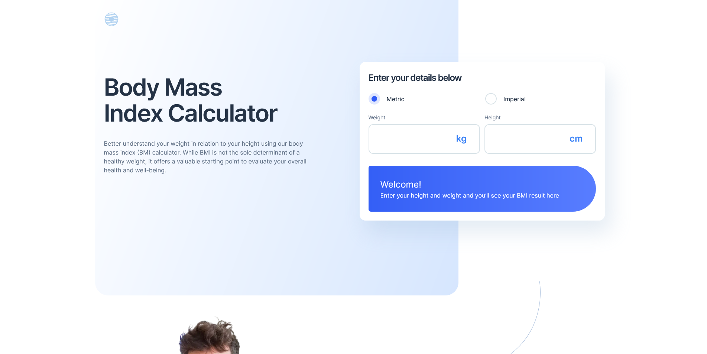

# Frontend Mentor - Tip calculator app solution

This is a solution to the [Tip calculator app challenge on Frontend Mentor](https://www.frontendmentor.io/challenges/tip-calculator-app-ugJNGbJUX). Frontend Mentor challenges help you improve your coding skills by building realistic projects.

## Table of contents

- [Overview](#overview)
  - [The challenge](#the-challenge)
  - [Screenshot](#screenshot)
  - [Links](#links)
- [My process](#my-process)
  - [Built with](#built-with)
  - [What I learned](#what-i-learned)
  - [Continued development](#continued-development)
  - [Useful resources](#useful-resources)
- [Author](#author)
- [Acknowledgments](#acknowledgments)

## Overview

### The challenge

Users should be able to:

- View the optimal layout for the app depending on their device's screen size
- See hover states for all interactive elements on the page
- Calculate the correct tip and total cost of the bill per person

### Screenshot

### Links

- Solution URL: [click here](https://www.frontendmentor.io/solutions/responsive-bmi-clalulator-page-react-tailwind-cssradix-uivite-UUIqNv8Agw)
- Live Site URL: [click here](https://mate1225.github.io/Body_Mass_Index_calculator/)

## My process

### Built with

- Semantic HTML5 markup
- Tailwind css
- Mobile-first workflow
- [React](https://reactjs.org/) - JS library
- [Radix UI](https://www.radix-ui.com/) - For styles

### What I learned

I learned how to use Radix UI ,and practiced my React skill-s.

### Continued development

In the future i want to Learn and practice other React hooks (useReducer,useContext...).

### Useful resources

- [React documentation](https://react.dev/) - THis helped me understand how to use some part of react.
- [React Scrimba](https://scrimba.com/learn/learnreact) - This helped me to learn react fundamentals.

## Author

- Website - [Mészáros Máté](https://mate1225.github.io/Projects/)
- Frontend Mentor - [@mate1225](https://www.frontendmentor.io/profile/mate1225)
